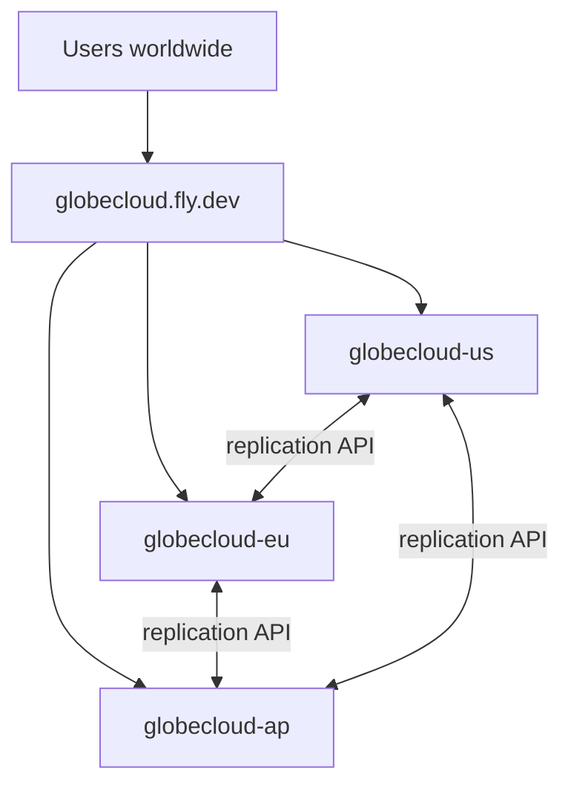

# GlobeCloud — Global Product Deployment (Fly.io)

Deploy GlobeCloud as a **global product**: one public URL (gateway) that geo-routes to three regional Fly.io backends (US, EU, AP).

```text
https://globecloud.fly.dev          ← global gateway (customers use this)
    ├── globecloud-us.fly.dev       ← us-east-1
    ├── globecloud-eu.fly.dev       ← eu-west-1
    └── globecloud-ap.fly.dev       ← ap-south-1
```

---

## Prerequisites

- [Fly.io account](https://fly.io) and [flyctl](https://fly.io/docs/hands-on/install-flyctl/) installed
- Logged in: `fly auth login`

---

## One-command global deploy

```bash
cd /Users/sohamkaul/Project/database

# Optional: set your own secrets (auto-generated if omitted)
export API_KEY=$(openssl rand -hex 32)
export REPLICATION_SECRET=$(openssl rand -hex 32)

chmod +x scripts/deploy-global-fly.sh
./scripts/deploy-global-fly.sh
```

This deploys **4 Fly apps**:

| App | Region | Role |
|-----|--------|------|
| `globecloud-us` | Virginia (iad) | Regional database + AI |
| `globecloud-eu` | Amsterdam (ams) | Regional database + AI |
| `globecloud-ap` | Mumbai (bom) | Regional database + AI |
| `globecloud` | Virginia (iad) | **Global gateway** (public URL) |

**Save the API_KEY** printed at the end — required for console and API access.

---

## Verify deployment

```bash
export GATEWAY=https://globecloud.fly.dev
export API_KEY=your-key-from-deploy

curl $GATEWAY/api/v1/health
curl -H "X-API-Key: $API_KEY" $GATEWAY/api/v1/global/status
curl -H "X-API-Key: $API_KEY" "$GATEWAY/api/v1/route?client_lat=51.5&client_lon=-0.1"
```

Open the global console: **https://globecloud.fly.dev/app**

Enter your API key in the sidebar to access protected endpoints.

---

## Custom domain (gateway only)

Point your domain at the **gateway app** only:

```bash
fly certs add app.yourdomain.com -a globecloud
```

Add the DNS records Fly provides. Regional backends stay on `*.fly.dev` URLs.

Update CORS:

```bash
fly secrets set CORS_ORIGINS=https://app.yourdomain.com -a globecloud
```

---

## Architecture



### Gateway mode (`DEPLOYMENT_MODE=gateway`)

- Probes all regional `/api/v1/health` endpoints (real latency)
- Routes `/api/v1/agent/ask`, orders, and inventory to nearest healthy region
- Exposes `GET /api/v1/global/status` for fleet dashboard

### Regional mode (`DEPLOYMENT_MODE=regional`)

- One SQLite volume per region
- Syncs via `GET /api/v1/replication/log` every 2 seconds
- Secured with shared `REPLICATION_SECRET`

---

## Environment variables

| Variable | Gateway | Regional | Description |
|----------|---------|----------|-------------|
| `DEPLOYMENT_MODE` | `gateway` | `regional` | Deployment role |
| `GATEWAY_PEERS` | required | — | `us-east-1:https://...,eu-west-1:https://...` |
| `PEER_URLS` | — | required | Sibling regional URLs |
| `REGION_ID` | — | required | `us-east-1`, `eu-west-1`, or `ap-south-1` |
| `API_KEY` | required | required | Primary customer API authentication |
| `API_KEYS` | optional | optional | Comma-separated additional rotatable keys |
| `REPLICATION_SECRET` | — | required | Peer replication auth |
| `CORS_ORIGINS` | recommended | recommended | Gateway public URL |
| `OPENAI_API_KEY` | optional | optional | Live LLM inference |

Fly configs: [`deploy/fly/`](deploy/fly/)

---

## Manual redeploy

```bash
# Redeploy one regional backend
cp deploy/fly/us.toml fly.toml
fly deploy -a globecloud-us

# Redeploy gateway
cp deploy/fly/gateway.toml fly.toml
fly deploy -a globecloud
```

---

## Troubleshooting

| Issue | Fix |
|-------|-----|
| Gateway shows regions unhealthy | Wait 30s after regional deploy; check `fly logs -a globecloud-us` |
| 401 on API | Pass `X-API-Key` header matching deploy secret |
| Replication not syncing | Ensure same `REPLICATION_SECRET` on all 3 regional apps |
| Health check failing | `/api/v1/health` is public (no API key required) |

---

## Local development (optional)

For local testing without Fly:

```bash
source .venv/bin/activate
pip install -e .
globe   # local mode on :8000
```

See [README.md](../README.md) for local and Docker regional simulation.

---

## CI/CD

Push to `main` triggers [`.github/workflows/deploy.yml`](../.github/workflows/deploy.yml):

1. Build React frontend + run smoke test
2. Deploy 4 Fly apps (requires `FLY_API_TOKEN`, `GLOBECLOUD_API_KEY`, `GLOBECLOUD_REPLICATION_SECRET` GitHub secrets)
3. Post-deploy smoke test against `https://globecloud.fly.dev`

---

## API key rotation

```bash
./scripts/rotate-api-key.sh
# or: NEW_KEY=$(openssl rand -hex 32) ./scripts/rotate-api-key.sh
```

Updates `API_KEY` on all Fly apps and saves credentials to `.env.deploy`.

For multiple active keys without rotation, set `API_KEYS=key1,key2` via `fly secrets set`.

---

## High availability

Gateway [`deploy/fly/gateway.toml`](../deploy/fly/gateway.toml) runs `min_machines_running = 2` for zero-downtime deploys. Regional apps use single machines with persistent volumes.

**Volume backups:**

```bash
fly volumes snapshots create globe_data -a globecloud-us
fly volumes snapshots list -a globecloud-us
```

---

## Observability

- Structured JSON request logs (`request_id`, `path`, `duration_ms`) via stdout
- Public status page: `https://globecloud.fly.dev/status`
- Rate limiting: 120 requests/minute per IP on `/api/*`
- Optional: set `SENTRY_DSN` env for error tracking (hook ready in middleware)
